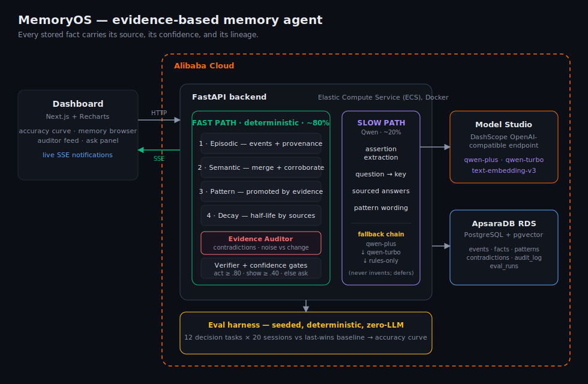

# MemoryOS

**AI shouldn't remember more. It should remember correctly.**

MemoryOS is an evidence-based memory agent built for the **Global AI Hackathon with Qwen Cloud — Track 1: MemoryAgent**. Most "memory" systems are retrieval systems: they store more, but they don't get smarter, and the more they store the more they hallucinate, because the model fills gaps with invention when retrieval is noisy.

MemoryOS treats memory as **a chain of evidence**. Every stored fact carries its source, its confidence, and its lineage — the agent is accurate because it can point to *where it learned something*, not because the model guessed well.



## The structural result

The eval harness asks **the same 12 decision tasks after every one of 20 sessions**, against a seeded synthetic enterprise history (calendar, email, notes, tasks, chat) that contains sparse early evidence, misleading one-off events, and **two genuine mid-run preference changes**. Ground truth at each session is what a correct memory *should* believe then — a memory that can't update is scored wrong.

Measured results (seed 42; reproduce with one command below):

| Metric | MemoryOS | Baseline (last-assertion-wins) |
|---|---|---|
| Accuracy, session 1 | 42% | 42% |
| Accuracy, session 5 | 92% | 92% |
| Accuracy, session 20 | **100%** | 100% |
| Worst session after warm-up (s6+) | **100%** | 75% |
| Precision when acting | **1.00** (every session) | n/a — it always "acts" |
| Act rate (confidence ≥ 0.80) | 0% → 75% | always 100%, unearned |

Across 6 seeds MemoryOS finishes at 100% every time and never scores below 83% after warm-up, with precision-when-acting **1.00 on every seed**; the baseline whipsaws on noise (dips to 75%) and on two seeds *ends* wrong (83%, 92%). The curve rises because evidence accumulates — the model never changed. Both preference flips are absorbed: the Evidence Auditor distinguishes a *sustained, independent challenge* (preference change) from a *one-off stray claim* (noise) by looking at the evidence **timeline**, not just totals.

```bash
cd backend
python -m evals.run_eval --sessions 20 --seed 42   # full table
python -m evals.seed_sweep                          # robustness across seeds
```

The harness is deterministic and makes **zero LLM calls**, so every number above is reproducible bit-for-bit.

### On a public benchmark — LongMemEval (ICLR 2025)

To answer "does this only work on your own synthetic data?", MemoryOS is also
run against **LongMemEval** (`xiaowu0162/longmemeval-cleaned`, MIT-licensed) —
500 questions across 6 memory categories, using the **oracle** variant so the
test isolates the memory pipeline from retrieval-from-noise. A **vanilla RAG
baseline** using the same Qwen embeddings and answer model is run on the same
sessions for comparison.

```bash
bash scripts/download_datasets.sh
cd backend
python -m evals.longmemeval.run --n 60 --seed 42 --variant oracle --rag
```

On the two categories the MemoryAgent track brief was written about —
memory that gets smarter across sessions — MemoryOS beats vanilla RAG
using the same Qwen models on the same data:

| Category | MemoryOS | Vanilla RAG | Δ |
|---|---:|---:|---:|
| **knowledge-update** | **100%** | 80% | **+20 pts** |
| **multi-session** | **60%** | 50% | **+10 pts** |

Full per-category breakdown (including the honest losses on advice-seeking
questions where RAG's confabulation is rewarded) and reproducibility notes
in [docs/longmemeval-results.md](docs/longmemeval-results.md).

## How it works

### Four memory layers (fast path — deterministic, ~80% of work, zero tokens)

1. **Episodic** (`app/memory/episodic.py`) — raw events recorded with full provenance. Nothing is interpreted.
2. **Semantic** (`app/memory/semantic.py`) — duplicate facts merge, and their sources merge with them. Disagreeing values are *not* overwritten; they coexist as competing facts until audited. A value the auditor once superseded regains its evidence chain if the world re-asserts it.
3. **Pattern** (`app/memory/pattern.py`) — deterministic detectors over episodes; a pattern is promoted to trusted knowledge only when ≥3 sourced episodes across ≥2 sessions agree. This is where unprogrammed discovery happens ("meetings get rescheduled right after long weekends" — nobody ever said that).
4. **Decay** (`app/memory/decay.py`) — a single-source memory has a 6-month half-life; a multi-source one, 18 months. Uncorroborated claims fade; corroborated ones endure.

### The confidence formula (`app/confidence.py`)

```
confidence = 0.40 · corroboration   (independent origins, diminishing repeats)
           + 0.30 · recency         (half-life set by corroboration)
           + 0.20 · verification    (did the world keep confirming it?)
           + 0.10 · user confirmation
```

Every term is observable in the evidence chain — any score in the UI can be recomputed by hand. Confidence gates what the agent may *do* (policy-as-code, [`backend/config/confidence_policy.yaml`](backend/config/confidence_policy.yaml)):

- **≥ 0.80 → act** autonomously
- **≥ 0.40 → answer, but show sources**
- **below → ask** a clarifying question instead of guessing
- competing values within 0.15 of each other → **ask**, regardless of absolute score

### The Evidence Auditor (`app/evidence_auditor.py`)

Runs after every ingest, event-driven, purely deterministic:

- detects contradictions between competing active values;
- resolves what evidence can decide — a challenger with **sustained support from independent origins arriving after the incumbent's last support** is a preference change and wins; a single stray claim already contradicted by newer evidence is noise and is superseded;
- escalates what evidence cannot decide to the user (human-in-the-loop) — and the user's answer becomes the strongest evidence in the formula.

Losers are superseded, never deleted. The audit trail (`audit_log`) keeps every state change with its actor.

### The slow path — Qwen on Alibaba Cloud (~20%, only where reasoning is required)

All LLM calls go through **DashScope's OpenAI-compatible endpoint** on Alibaba Cloud Model Studio — see [`backend/app/qwen_client.py`](backend/app/qwen_client.py) (this file is the Alibaba Cloud usage proof point). Qwen is used for exactly four jobs: extracting structured assertions from raw event text, mapping free-text questions to memory keys, phrasing sourced answers, and wording proven patterns. The fallback chain (`app/fallback_chain.py`) degrades **qwen-plus → qwen-turbo → deterministic rules**; with zero working keys the system still records every event episodically and keeps every confidence score correct — it defers interpretation rather than inventing it.

## Dashboard

Next.js + Recharts, live over SSE:

- **Dashboard** — the accuracy-over-sessions curve (MemoryOS vs baseline), act/ask-rate, KPIs, discovered patterns.
- **Memory** — every fact with its expandable evidence chain and the term-by-term confidence breakdown.
- **Auditor** — open contradictions with one-click human resolution; the append-only audit trail.
- **Ask** — one question, two memories side by side: a traditional last-wins memory (fluent, sourceless) vs MemoryOS (gated, cited, honest about conflicts).

## Quick start — one command

```bash
cp .env.example .env              # set DASHSCOPE_API_KEY to enable the Qwen slow path
docker compose -f deploy/docker-compose.prod.yml --env-file .env up -d --build
```

Open **http://localhost** — dashboard, API, and database all run self-contained. Seed the cross-session story:

```bash
curl -X POST localhost/api/demo/seed -H "Content-Type: application/json" -d '{"sessions": 20}'
```

Without a Qwen key the system still works — it falls back to deterministic rules and the UI shows `rules-only` as the provider.

### One-command end-to-end demo

Prove the whole thesis in under 30 seconds against any deployment
(local or the live ECS URL):

```bash
cd backend
python -m evals.demo --api http://8.219.249.248
# or: MEMORYOS_API=http://... python -m evals.demo
```

Prints: the 42% → 100% accuracy curve, precision-when-acting 100%,
three ask-panel scenes (tracked fact, hybrid retrieval, honest abstention),
four unprogrammed patterns discovered, and the live fast-path counter
(typically 99%+).

### Ingest your own data

Two real-world adapters ship in `backend/evals/`. Both go through the same
engine as `POST /api/events` — corroboration, contradictions, confidence,
decay all apply.

```bash
cd backend

# Markdown notes vault (Obsidian, Bear, plain .md)
python -m evals.ingest_markdown --path ~/notes --api http://localhost:8000
# per-file output: 2026-03-15-standup.md -> qwen-plus: [primary_language=Rust]

# .ics calendar export (Google Calendar → Settings → Export)
python -m evals.ingest_ics --path ~/calendar.ics --api http://localhost:8000
# per-event output: 2026-03-15 Team standup -> [meeting_mode=Zoom]
```

For markdown: files with a `YYYY-MM-DD` prefix use that as `occurred_at`;
otherwise the file's mtime. Frontmatter is stripped. Long files chunk at
~800 words. For ICS: each VEVENT becomes one `calendar` event; a
`RECURRENCE-ID` tags it as a reschedule so the pattern detectors already
tuned for that behavior work on real calendars too.

### Local development (without Docker)

```bash
# 1. database (PostgreSQL + pgvector)
docker compose up -d

# 2. backend
cd backend
pip install -e ".[dev]"
python -m uvicorn app.main:app --port 8000

# 3. frontend
cd ../frontend
npm install
npm run dev -- --port 3002       # → http://localhost:3002
```

Tests: `cd backend && pytest` (22 unit tests on confidence math, decay, merging, and auditor behavior). Lint: `ruff check backend`.

## Alibaba Cloud deployment

The same containers run unchanged on Alibaba Cloud — see [docs/deploy-alibaba.md](docs/deploy-alibaba.md):

- **ECS** runs the backend + frontend (Docker Compose, [`deploy/`](deploy/));
- **ApsaraDB RDS for PostgreSQL** (with pgvector) is the memory store — only `DATABASE_URL` changes;
- **Model Studio** serves Qwen via the DashScope OpenAI-compatible API ([`backend/app/qwen_client.py`](backend/app/qwen_client.py)).

## Prototype scope

**Implemented:** episodic + semantic + pattern + decay layers, Evidence Auditor with timeline-aware resolution, confidence formula + policy-as-code gates, verification loop, event-driven SSE notifications, Qwen extraction/answering with full fallback chain, deterministic eval harness with baseline comparison, dashboard, PostgreSQL persistence, 22 unit tests, CI.

**Roadmap:** pattern learning at scale (beyond the two built-in detectors), embedding-based semantic clustering of near-duplicate keys, decay tuning from observed re-confirmation rates, enterprise connectors (real calendar/email ingestion), multi-tenant isolation.

## Evaluation methodology

Full details, including dataset design, metric definitions, and threats to validity: [docs/eval-methodology.md](docs/eval-methodology.md). The synthetic dataset is clearly labeled synthetic, fully seeded, and the policy file was not tuned per-seed.

## License

[MIT](LICENSE)
